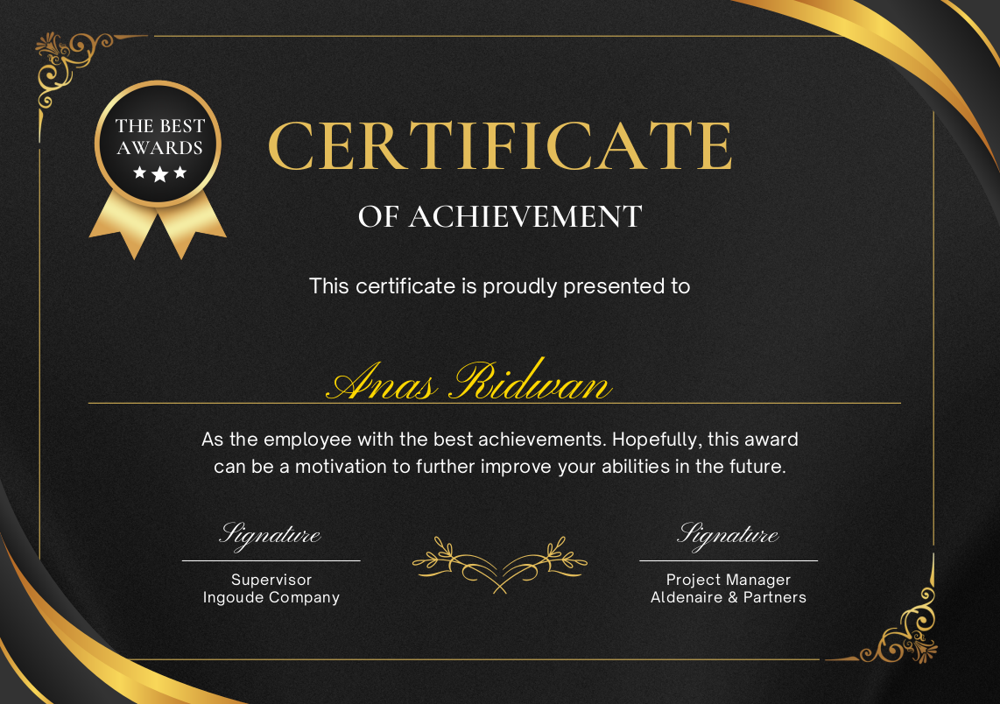

# Certificate Generator using Python

This Python script allows you to generate personalized certificates by adding custom text to a pre-designed certificate template. It utilizes libraries such as `PyPDF2` and `ReportLab` to handle PDF manipulation and text overlay.

## Features

- Add custom text to a certificate template
- Use any desired font by specifying the font path
- Merge text overlays with existing PDF templates

# Running In a VirtualEnv

Create a virtual environment using:
```
python3 -m venv venv
```

```
pip install -r requirements.txt
```

# Sample Output
